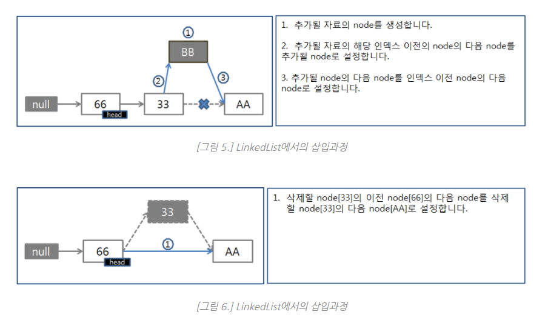

# 생활코딩 - DataStructure 강좌(64개) 
[생활코딩 강좌] /JAVA/DataStructure/Opentutorial

# 자료구조는 근본적으로 무엇인가를 '표현'하는 도구. 
  표현을 위해서 저장과 삭제라는 기능이 제공되는 것으로 이해하는 것이 옳다.

# 탐색 
* 순차 탐색 = 맨 앞에서부터 순서대로 탐색을 진행하는 알고리즘
* 이진 탐색 = 탐색의 대상을 반복해서 반씩 떨구어 내는 알고리즘(이진 탐색 조건: 정렬되어 있어야 함)
* 재귀 = 함수 내에서 자기 자신을 다시 호출하는 함수를 의미
* 추상 자료형(Abstract Data Type. ADT) = 구체적인 기능의 완성 과정을 언급하지 않고, 순수하게 기능이 무엇인지 나열한 것 (기능들의 연속)

# 시간 복잡도

최악의 경우를 시간 복잡도의 기준으로 삼는다. (평균적인 경우는 각 알고리즘마다 가정을 설정하기 어렵고 객관적인 판단이 어렵기 때문)

O(1) < O(logn) < o(n) < o(nlogn) < o(n2) < o(n3) < o(2의 n승)

O(1) : 입력 데이터의 크기와 상관없이 언제나 일정한 시간이 걸리는 알고리즘을 말한다. (Constant Time)

입력되는 데이터양과 상관없이 일정한 실행 시간을 가진다.
알고리즘이 문제를 해결하는데 오직 한 단계만 거친다.

O(n) : 입력 데이터의 크기에 비례해서 처리시간에 걸리는 알고리즘을 표현할 때 사용 (Linear Time)

데이터양에 따라 시간이 정비례한다.
Linear search, for 문을 통한 탐색을 생각하면 된다.

O(n^2) : Quadratic Time

데이터양에 따라 걸리는 시간은 제곱에 비례한다. (효율이 좋지 않음, 사용 X)
해당 유형은 이중 Loop내에서 입력 자료를 처리 하는 경우에 나타난다. N값이 큰 값이 되면 실행 시간은 감당하지 못할 정도로 커지게 될 것이다.
문제를 해결하기 위한 단계의 수는 입력값 n의 제곱

O(log n) : Binary search tree access(이진 검색) - search(검색), insertion(삽입), deletion(삭제)

데이터양이 많아져도, 시간이 조금씩 늘어난다.
시간에 비례하여, 탐색 가능한 데이터양이 2의 n승이 된다.
문제를 해결하는데 필요한 단계들이 연산마다 특정 요인에 의해 줄어든다.
만약 입력 자료의 수에 따라 실행 시간이 이 log N의 관계를 만족한다면 N이 증가함에 따라 실행시간이 조금씩 늘어난다. 주로 커다란 문제를 일정한 크기를 갖는 작은 문제로 쪼갤때 나타나는 유형이다.

# 자료구조

## Array 
Array는 논리적 순서와 물리적 순서가 일치하여, index값을 통한 원소 접근이 용이하고 구현이 쉽다. 

### 단점 
1. 삽입, 삭제 등에 대한 연산에 필요한 Cost가 높다.

삭제->삭제한 인덱스 뒤의 원소들을 모두 앞으로 Shift연산, 삽입-> 삽입한 인덱스 포함, 그 뒤의 인덱스들에 Shift 연산을 해줘야 한다. 

2. 배열은 정의와 동시에 길이를 지정하며 길이를 바꿀 수 없고, 배열에서 설정된 엘리먼트의 개수를 알아낼 수 없다.
3. 기능이 없다.
4. 데이터에 대한 인덱스 값이 고정되어야 한다.(삭제된 엘리먼트의 공간이 그대로 남아 메모리 낭비)

### 인덱스가 중요한 경우는 배열을 사용, 인덱스가 중요하지 않은 경우에는 리스트를 사용한다.

* 배열의 삽입/삭제 연산에 대한 비효율성을 극복하고자 등장한 것이 LinkedList 이다. 
  Array와 LinkedList의 차이점은, LinkedList는 논리적으론 순서대로 되어있으나 물리적으론 순서대로 되어있지 않다. 
  대신 LinkedList는 각 원소가 다음 index 위치에 해당하는 물리적 주소를 가지고 있다. 그렇기에 삽입/삭제시에는 데이터를 Shift할 필요 없이, 해당되는 원소의 물리적 주소만 변경해주면 된다. 
  하지만 이 같은 특징 때문에 원하는 index를 참조하려면, 1번 index부터 차례대로 접근해야 한다는 비효율성이 있다.
  
## List
* 리스트는 배열이 가지고 있는 인덱스라는 장점을 버리고 대신 빈틈없는 데이터의 적재 라는 장점을 취한 데이터 스트럭쳐
* 리스트 자료구조의 핵심은 엘리먼트들 간의 순서. 따라서 리스트를 다른 말로는 시퀀스(sequence) 라고도 부른다. 즉 순서가 있는 데이터의 모임이 리스트이다.
* 리스트에서 인덱스는 몇 번째 데이터인가 정도의 의미를 가진다. (배열-Array에서의 인덱스는 값에 대한 유일무이한 식별자)
* 빈 엘리먼트는 허용하지 않는다.
* 순차성을 보장하지 못하기 때문에 spacial locality 보장이 되지 않아서 cash hit가 어렵다.

### 데이터 갯수가 확실하게 정해져 있고, 자주 사용된다면 array가 더 효율적이다.

## list 자료구조의 대표 기능 (operation)
자료구조에서 가장 중요한 점은, 해당 자료구조가 어떠한 기능을 가지고 있느냐는 것이다.

* 처음, 끝, 중간에 엘리먼트를 추가/삭제 하는 기능
* 리스트에 데이터가 있는지를 체크하는 기능
* 리스트의 모든 데이터에 접근할 수 있는 기능

## Java에서 배열과 리스트
* 자바는 배열과 리스트를 모두 지원하고, 두 가지가 완전히 분리되어, 개발자가 원하는대로 직접 선택가능하다.

// 배열 - 추가, 삭제가 어렵다. 직접 구현해야한다.
int[] numbers = {10,20,30,40,50};

// 리스트 (ArrayList)
ArrayList numbers = new ArrayList();

numbers.add(10); // 추가
numbers.remove(0); // 삭제

// 리스트 (LinkedList)
LinkedList numbers = new LinkedList();

numbers.add(10); // 추가
numbers.remove(0); // 삭제

## 자바는 2가지 형태의 리스트를 지원
* LinkedList / ArrayList
똑같은 기능(메소드)를 가진 리스트가 2가지 존재한다.
- LinkedList는 순서대로 늘어선 것이 아니라 자료의 주소 값으로 서로 연결되어 있는 구조를 하고 있습니다.
- ArrayList는 데이터들이 순서대로 쭉 늘어선 배열의 형식을 취함
 

### 인덱스를 이용해서 데이터를 가져오는 것이 빈번하다면 내부적으로 배열을 이용하는 ArrayList가 훨씬 빠르다. 하지만 데이터의 추가/삭제가 빈번하다면 LinkedList가 훨씬 효과적이다
[실제 구현 관련자료] (http://www.nextree.co.kr/p6506/)

## Stack
선형 자료구조의 일종으로, FILO(First In Last Out)의 대표적인 예시로 들 수 있으며, 말 그대로 먼저 들어갔다가 나중에 나오는 구조이다. 

즉 가장 나중에 들어간 원소가 가장 먼저 나오게 된다. 미로찾기, 괄호 유효성 체크 등에 활용된다.

## Queue 
역시 선형 자료구조이며, Stack과는 반대로 FIFO(First In First Out) 구조이다. 

줄을 선다는 뜻과 같게, 먼저 들어간 원소가 가장 먼저 나온다. 작업 우선순위, Heap 구현 등에 사용된다.

## Tree
Tree 는 Stack, Queue와는 다르게 비선형 자료구조로, 계층적 구조를 표현하는 자료구조이다. 

실제 데이터를 삽입하고 삭제한다는 생각 이전에, 표현에 집중하자. 트리의 구성 요소는 다음과 같다.

Node (노드) : 트리를 구성하고 있는 원소 그 자체를 말한다.
Edge (간선) : 노드와 노드사이를 연결하고 있는 선을 말한다.
Root(Node) : 트리에서 최상위 노드를 말한다.
Terminal(Node) : 트리에서 최하위 노드를 말한다. Leaf Node라고도 한다.
Internal(Node) : 트리에서 최하위 노드를 제외한 모든 노드를 말한다.

![이미지 출처] http://blog.daum.net/blog/BlogTypeView.do?blogid=0JHcJ&articleno=8382646&categoryId=791705®dt=20100728174800

## Binary Tree (이진트리)
Binary Tree는 Root 노드를 포함, Leaf 노드를 제외한 모든 노드의 자식이 두 개인 것을 말한다. 공집합 역시 노드로 인정한다. 노드로 이루어진 각 층을 Level이라 하며, Level의 수를 이 트리의 height라 한다.

이진트리에는 모든 Level이 가득 찬 이진 트리인 Full Binary Tree(포화 이진 트리) 와 위에서 아래로, 왼쪽에서 오른쪽으로 순서대로 채워진 트리인 Complete Binary Tree(완전 이진 트리) 가 있다. 배열로 포화 이진트리와 완전 이진트리를 구현했을 때, 노드의 개수 n에 대해서 i번째 노드에 대해서 parent(i) = i/2 , left_child = 2i, right_child = 2i + 1 의 인덱스 값을 갖는다.

## BST, Binary Search Tree (이진 탐색 트리)
자료구조에서 효율적인 탐색 방법만을 고민할 것이 아니라, 효율적인 저장방법도 고민해야 한다. Binary Search Tree (이진 탐색 트리)는 이진 트리이며, 데이터를 저장하는 특별한 규칙이 있다. 그 규칙으로 찾고자 하는 데이터를 찾을 수 있다.

* 이진 탐색 노드에 저장된 값은 유일한 값이다.
* 루트 노드의 값은 왼쪽에 있는 모든 노드의 값보다 크다.
* 루트 노드의 값은 오른쪽에 있는 모든 노드의 값보다 작다.
* 각 서브 트리별로 2, 3번 규칙을 만족한다.
* 저장할 때 위의 규칙대로 잘 저장하기만 하면, 루트 노드로부터 원하는 값을 찾아나가는 것은 어렵지 않을 것이다. 하지만 값이 추가되고 삭제됨에 따라, 한 쪽에만 치우친 Skewed Tree(편향 트리)가 될 가능성이 있다. 이를 해결하기 위해 Rebalancing이라는 기법을 사용하여 트리를 재조정하게 된다.

![이미지 출처] https://songeunjung92.tistory.com/31

* 평균 탐색시간은 O(logN), 최악 탐색시간은 O(N)

### Red Black Tree
RBT(Red-Black Tree)는 위에서 설명한 Rebalancing기법의 하나로, 기존 이진탐색트리의 삽입, 삭제, 탐색의 비효율성을 개선한 방법이다. 

RBT는 다음과 같은 규칙을 따른다.

* 각 노드는 Red 혹은 Black이라는 색깔을 갖는다.
* 루트 노드는 Black이다.
* 각 말단 노드(NIL)는 Black이다.
* 어떤 노드의 색이 Red라면, 두 자식 노드의 색은 모두 Black이다.
* 어느 한 노드로부터 리프노드(NIL)까지의 Black의 수는 리프노드를 제외하면 모두 같다(이를 Black-Height라 한다).

RBT 특징으로는 다음과 같다.
* Binary Search Tree이므로, BST의 특징을 모두 갖고있다.
* 루트로부터 말단 노드까지의 최소 경로는 최대 경로의 두 배보다 크지 않다. 이를 Balanced한 상태라 한다.
* 노드의 Child가 없을 경우, Child를 가리키는 포인터에 NIL(혹은 NULL)값을 저장한다. 이러한 NIL 노드들을 말단 노드로 간주한다. 말단 노드이기 때문에, 이 노드들의 색은 Black이다.

RBT에서의 삽입 과정은 다음과 같다. 우선 새로 삽입한 노드를 BST 특성을 유지하며 삽입한 후, 색을 Red로 칠한다. 이는 Black-Height의 수를 최대한 유지하기 위해서이다. 삽입 결과 RBT 특성이 위배된다면, 노드의 색을 다시 칠한다. 만일 Black-Height특성, 즉 위의 5번 규칙이 위배되었다면, Rotation을 통해 조정한다.

삭제 과정 역시 마찬가지로 우선 BST 특성을 유지하며 노드를 삭제한다. 삭제될 노드의 Child와 색깔로 Rotation 방법이 정해진다(후에 삭제 과정을 자세히 조사하겠다).

## Binary Heap
Binary Heap은 배열에 기반한 완전 이진탐색트리이며, Max-Heap과 Min-Heap이 있다. Max-Heap은 상위 노드의 값이 하위 각 노드의 값보다 크며, Min-Heap은 반대로 상위 노드의 값이 하위 각 노드의 값보다 작다(형제 노드끼리는 상관없다). 이 성질을 이용하면 최대, 최솟값을 찾아내는 것이 훨씬 용이하다.

![이미지 출처] https://ieatt.tistory.com/40

## HashTable
HashTable은 내부적으로 배열을 사용하며, 평균적으로 빠른 탐색속도(O(1))를 갖는다. 평균적으로라는 의미는 충돌을 고려하지 않았을 때이다. Key값을 해시함수를 통하여 인덱스로 변환 후에, 그 인덱스에 집어 넣는다. 만약 다른 Key값을 해시함수를 통과시켰는데 같은 인덱스가 나온다면, 그걸 충돌이라고 한다.
충돌 해소법(Resolve Conflict) 방법에는 기본적인 두 가지 방법이 있다.

### Open Address 방식 (개방 주소법)
충돌 발생 시, 다른 인덱스를 찾는다.

### Linear Probing : 순차적으로 탐색하여 다음 인덱스를 찾는다.
* Quadratic Probing : 2차 함수를 이용해 탐색할 위치를 찾는다.
* Double Hashing Probing : 충돌 발생시 새로운 해시함수를 활용하여 주소를 찾는다.
* Separate Chaining 방식 (분리 연결법)
  충돌 발생 시 다른 인덱스를 찾는 대신, 그 인덱스에다가 연결하는 방법.
  연결 리스트를 이용하여 연결하는 방법과, Tree(RBT)를 이용하여 연결하는 방법이 있다. 두 방식 모두 Worst Case가 O(M)이다. 데이터의 크기가 크다면 Separate Chaining, 아니라면 Open Address     방식이 더 낫다.

Hashmap의 Resize : 일정 개수이상 크기가 커지면, 해시 버킷의 크기를 두 배로 늘림.

### Graph
정점과 간선의 집합이며, 일종의 Tree이다.

Undirected와 Directed Graph가 있는데, 방향성 유무로 결정된다.

Degree란 Undirectd Graph에서 정점에 연결된 간선의 개수이다. Directed Graph에서의 Degree는 방향성이 있기 때문에 둘로 나뉘는데, 나가는 간선의 개수는 Outdegree, 들어오는 간선의 개수를 Indegree라 한다.

가중치 그래프 란 간선에 가중치를 둔 그래프, 부분 그래프 란 한 그래프의 일부 정점 및 간선으로 이루어진 그래프.

그래프의 구현 방법 :

인접 행렬 : 정방 행렬을 사용하여 구현. 연결 관계를 O(1)로 파악 가능. 공간 복잡도는 O(2V)
인접 리스트 : 리스트를 사용하여 구현. 정점간 연결 여부 파악애 오래 걸림. 공간 복잡도는 O(E + V)
탐색 방법에는 깊이 우선 탐색(DFS, Depth First Search)와 너비 우선 탐색(BFS, Breadth First Search)이 있다.
깊이 우선 탐색은 말 그대로 깊숙히 들어가서 탐색하고 나오는 것이며, 유용한 자료구조는 Stack이다.
너비 우선 탐색은 임의의 한 정점에 대해 인접한 정점을 queue에 넣고(enqueue), dequeue연산에서 나온 하나의 정점으로 들어가서 그 정점의 인접한 정점을 다시 Queue에 넣어서 탐색하는 방식. BFS로 찾은 경로는 최단 경로이다.

[참고자료]
https://velog.io/@hygoogi/%EC%9E%90%EB%A3%8C%EA%B5%AC%EC%A1%B0-%EC%A0%95%EB%A6%AC-8xk66rgt2h
https://sjs2215.tistory.com/83
https://wayhome25.github.io/cs/2017/04/17/cs-18-1/
http://www.nextree.co.kr/p6506/
